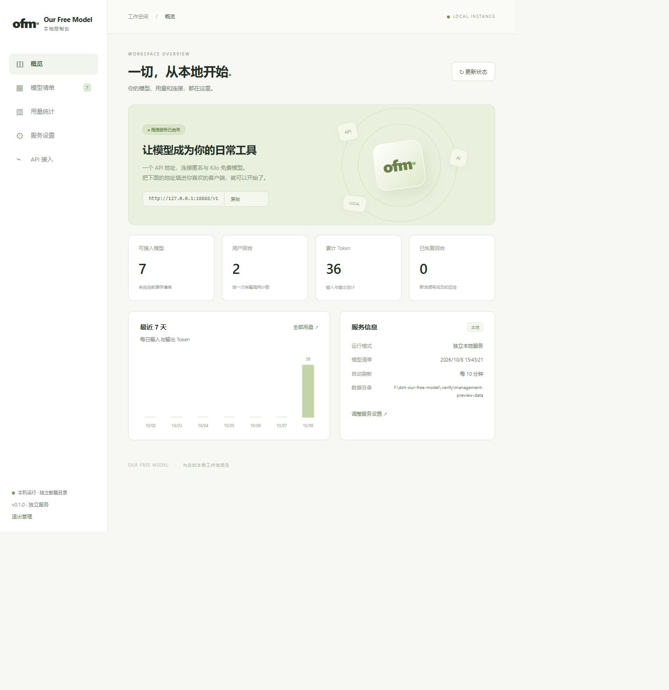

# 独立服务网页管理验收记录

日期：2026-10-08。

## 交付范围

独立本地服务提供概览、模型清单、用量统计、服务设置和 API 接入五个页面。
网页与管理接口位于 `packages/standalone`，不需要 DSH。
插件继续使用原页面；两端共用统计汇总函数和推理运行时。
本次未提供独立安装包、账号渠道、桌面壳或 Release。

## 自动验证

| 命令 | 实际结果 |
| --- | --- |
| `npm run test:contributor` | 31/31 套件通过，包含原插件及独立服务回归 |
| `npm run test:management` | 最终管理实现 13/13 项通过 |
| `npm run typecheck` | 通过；当前 TypeScript 配置只覆盖 adapter 边界 |
| `node --check packages/standalone/web/app.js` | 通过 |
| `node --check packages/standalone/management.mjs` | 通过 |
| `git diff --check` | 通过 |
| `npm pack --dry-run --json` | 通过；插件包包含 `src/core/stats.js`，独立服务不混入插件包 |
| `npm run test:release` | 0/3 套件通过；变更后的插件文件哈希与现有 manifest 不一致，且新统计文件未列入 manifest |

发布检查失败的文件为 `index.js`、`package.json`、`src/forward.js`，
新增 `src/core/stats.js` 还需加入签名清单。没有修改或伪造签名记录。
维护者需按现有发布流程重新签署 manifest、更新 catalog 并重新运行发布检查。

管理测试使用临时数据目录和本机 HTTP 上游替身，覆盖一次性链接、会话、
同源与 Host 校验、设置校验、磁盘写入失败、暂停推理后恢复、模型操作、
统计写入、密钥轮换、到期登出、重启失效和周期调度。

## 浏览器实际操作

使用独立验收目录和本机上游替身，没有读取用户已有 DSH 数据，没有访问真实模型上游。
验收实例为 `http://127.0.0.1:18888/`，截图中的模型清单与回答来自替身。

- 一次性链接成功兑换会话，地址栏移除临时凭证。
- 搜索模型后发送单模型测试，界面显示替身回答，统计记录真实经过核心的请求。
- 通过服务设置暂停并恢复推理、保存刷新间隔。
- 验证地址复制、密钥显示与隐藏，以及轮换确认和取消。
- 18 秒的模型测试期间改变搜索条件，重新生成的测试按钮保持禁用；结束后恢复。
- 实际 390 CSS 像素宽度下，五个页面均满足整页 `scrollWidth === clientWidth`。
- 窄屏保留退出管理按钮；验收后恢复默认浏览器视口。
- 最终浏览器控制台没有 error 或 warn。

桌面概览：

390 CSS 像素窄屏概览：

## 未验证项

- 真实匿名/Kilo 上游的联网推理未执行，本次不证明实时模型可用性。
- 没有进行独立安装制品验收。
- 发布签名检查尚未通过，当前不能作为已验证的发布版本。
- 本阶段没有进行独立 Agent 审查；以上为实施中的自查、自动测试和浏览器验收。
