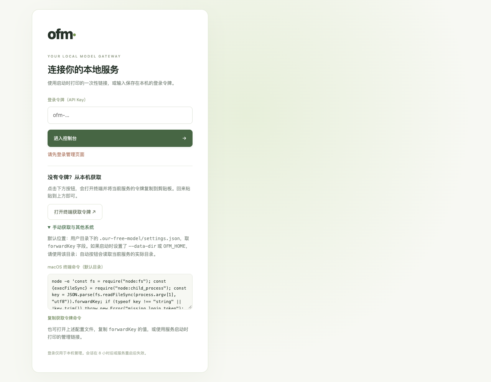
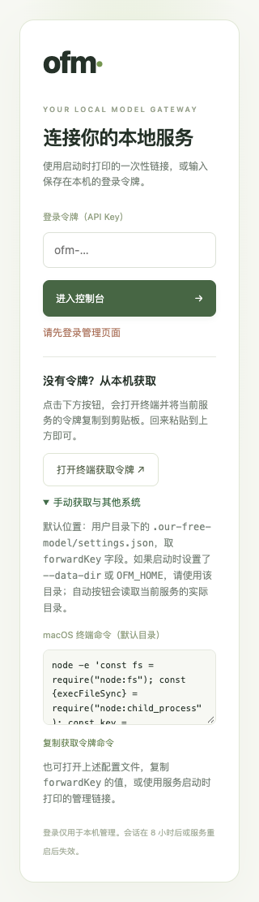

# macOS 登录令牌入口验收

## 实际改动

macOS 现在使用可见 Terminal 读取当前服务实际数据目录的 `settings.json`，
经 stdin 将 `forwardKey` 交给系统 pbcopy。Windows 保留 PowerShell 流程。
页面根据服务端标记的系统调整按钮、手动获取命令和复制快捷键提示。
Linux 禁用自动打开按钮，保留手动入口。

来源校验、空 JSON 请求体、并发限制、30 秒冷却及管理鉴权保持不变。
打开窗口只返回 `{ ok: true }`，不返回密钥，也不建立管理会话。
不需要迁移设置或账号数据。

## 实际验证

- `node --check packages/standalone/web/app.js`：通过。
- `node --check scripts/standalone-login-ui-test.mjs`：通过。
- `npm run test:standalone`：20/20 通过。
- `npm run test:contributor`：32/32 套通过；管理专项 15/15 通过。
- `npm run test:release`：3/3 套通过。
  这是已有插件发布记录的验证，不表示独立服务已制作发布安装包。
- `npm exec --yes --package=typescript@5.9.2 -- tsc --noEmit -p tsconfig.json`：
  通过；使用临时缓存中的 TypeScript 检查原有 adapter 边界，未修改依赖或锁文件。
- `git diff --check`：通过。
- 真实 shell 参数测试覆盖中文、空格、单/双引号、换行、`$HOME` 和命令替换字符；
  Windows 启动参数通过替身及 EncodedCommand 解码验证。
- 隔离目录 macOS 实机验证：浏览器点击按钮后返回 200，实际新建可见 Terminal，
  剪贴板与隔离验收令牌相同；终端显示复制成功而不显示令牌；
  再次点击出现冷却提示，未登录读取 `/key` 仍返回 401。
- 浏览器检查 1280×900、390×844、320×740 三个视口：无水平溢出，
  所有登录控件在视口内；手动命令复制值一致，页面无 JavaScript 错误。
  实机测试结束后关闭测试窗口并还原原有文本剪贴板。

实际执行 `node scripts/standalone-login-ui-test.mjs` 时，通过环境变量指定了
本机已安装的 Playwright、Google Chrome 和截图目录，并启用实机 Terminal 验收。
个人机器路径不提交到仓库；下面使用占位路径展示复现方式：

```sh
OFM_PLAYWRIGHT_MODULE=/path/to/node_modules/playwright \
OFM_BROWSER_EXECUTABLE='/Applications/Google Chrome.app/Contents/MacOS/Google Chrome' \
OFM_VERIFY_MAC_TERMINAL=1 \
OFM_UI_SCREENSHOT_DIR=docs/verification/images \
node scripts/standalone-login-ui-test.mjs
```

默认不设 `OFM_VERIFY_MAC_TERMINAL` 时使用替身启动器，不操作本机 Terminal。
Windows 实机、Linux 实机、系统拒绝自动化授权时的实际弹窗未验收。
自动化权限被拒绝时仍保留手动获取说明，不绕过系统权限。

## 截图




