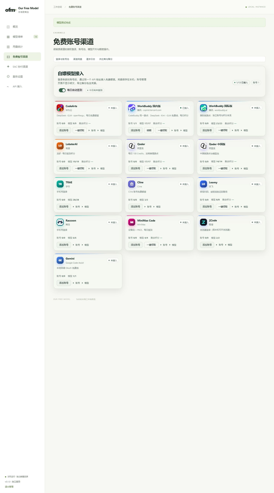
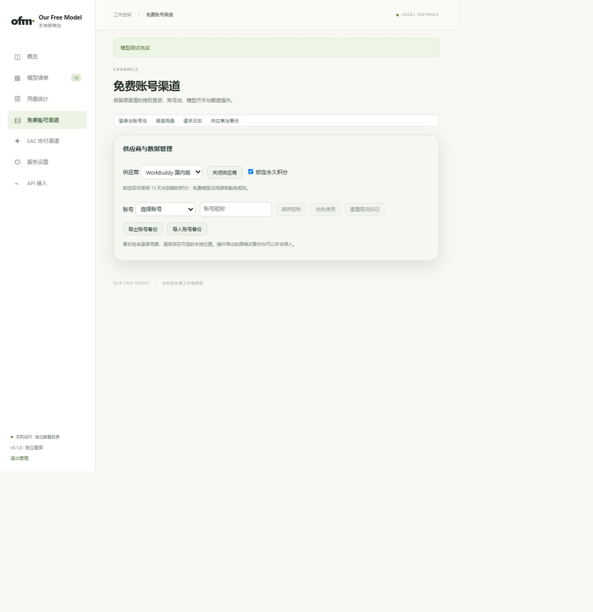
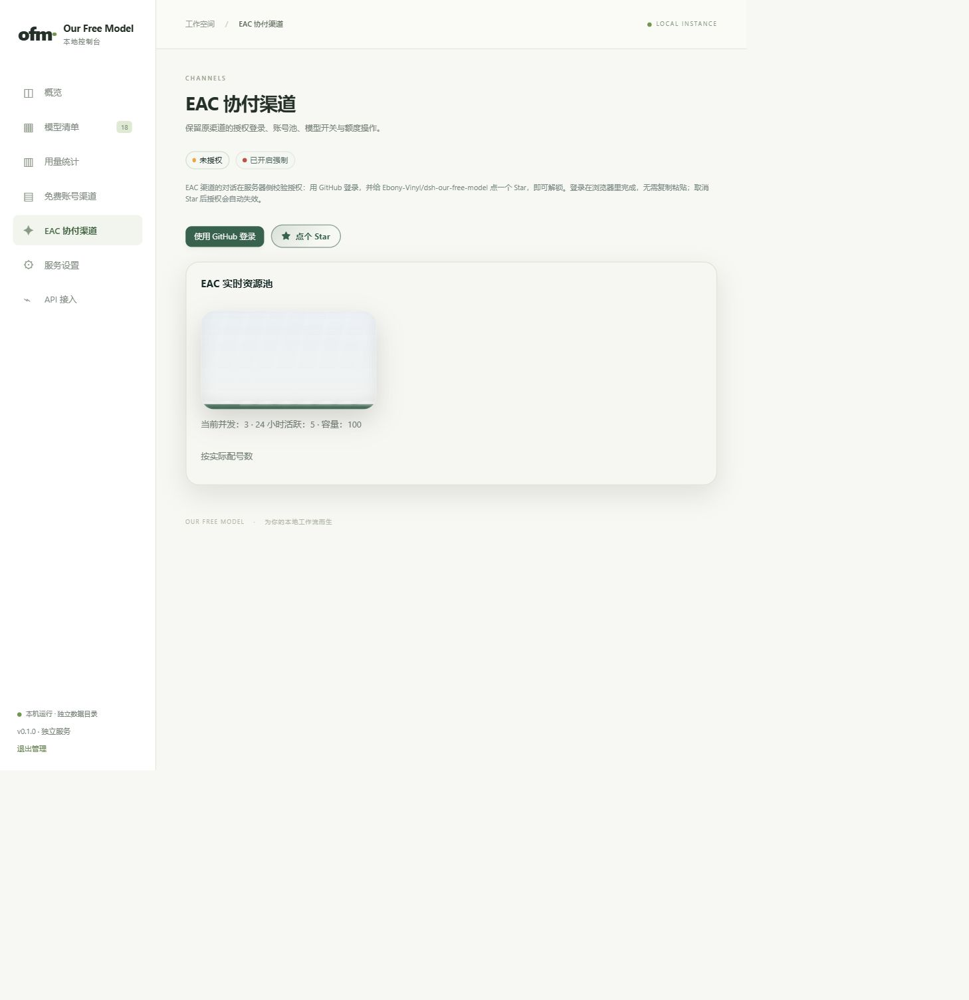
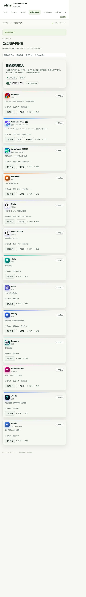

# 独立应用渠道补齐验收

## 范围与环境

2026-10-08，Windows、Node.js 24.18.1。复用原十三个渠道业务与 EAC 授权流程，
独立账号、配置和账本写入明确的数据目录；原插件渠道包、页面与宿主判定保留。
本次是完整仓库源码运行版本，尚未制作独立安装包或发布 Release。

## 自动验证

| 命令 | 实际结果 |
| --- | --- |
| `npm run test:contributor` | 32/32 套通过，包含独立服务 20/20、管理 13/13、渠道 11/11 及原插件回归 |
| `npm run test:standalone-channels` | 11/11 通过，运行真实适配器；网络仅请求本机 HTTP 替身 |
| `npm run typecheck` | 通过；范围是原 adapter seam，并非全部新增 JavaScript |
| `node --check <文件>` | 15 个独立入口、渠道、网页与生成器文件通过 |
| `node scripts/build-standalone-channels.mjs --check` | 通过，生成业务与原包及转换规则一致 |
| `node scripts/build-standalone-ui.mjs --check` | 通过，共享页面转换与生成脚本一致 |
| `git diff --check` | 通过 |
| `npm run test:release` | 未通过：修改后的发布文件与已有签名清单不一致，需维护者准备并签署新清单 |

渠道专项覆盖真实十三个适配器注册、模型容量与思考档位、Chat/Responses、
流式与工具调用、内联图片、账号管理和备份、多实例隔离、重启持久化、
模型/供应商禁用、永久积分锁定、两层用量、网络取消和停止后禁止迟到凭据写入。
EAC 覆盖原 GitHub prepare/poll/ACK、签名、独立用户 token、模型清单、
资源池、退出、迟到状态隔离及取消。测试没有访问外部真实推理或登录上游。

## 网页实际操作

使用内置浏览器访问 `http://127.0.0.1:18888/`，数据位于忽略目录
`.verify/channels-preview-data`，只有本机替身账号。观察并验证：

- 原十三张渠道卡均可见；展开 WorkBuddy 国内版替身账号并点击测试，页面显示连接正常。
- 供应商与备份页：保存昵称、勾选永久积分锁定、关闭后重新启用供应商，页面显示保存成功。
- 重启后昵称、积分锁定与账号保留；模型清单显示中文供应商名称及实际容量，未知容量不显示为零。
- 在统一模型页测试 `buddy/fixture-free`，回答为“OK · 本机替身请求已完成”，上下文 128K、输出 4096。
- 请求日志记录该调用成功、输入 11、输出 7、共 18 Token；渠道用量和日志页面正常加载。
- EAC 页面显示未授权、GitHub 登录入口及本机替身资源池（并发 3、24 小时活跃 5、容量 100）。
  没有点击第三方授权或代用户登录。
- 设置 390×844 的临时浏览器视口，渠道卡切换为单列。此浏览器工具上报的 CSS 视口宽度为 506，
  文档 clientWidth/scrollWidth 均为 487，没有文档横向溢出；这不等同于真实手机测试。
  验收结束后恢复视口。
- 当前验收标签的控制台 error/warn 记录为空。

### 截图

以下为本机替身数据，不代表服务商实时额度或可用性。

## 未验证与发布限制

未逐家使用真实外部账号完成登录、验证码、OAuth、签到、续期或额度调用；
上游改动及当前可用性仍需用户实际账号验证。本机替身通过不保证所有服务商在线。
没有创建独立安装制品、进行实际 DSH 桌面视觉验收或发布 Release。
已检查原插件回归和数据隔离，未读取或迁移用户 DSH 凭据。
发布清单签署属于维护者发布流程，本次不替换信任根、不伪造签名。
