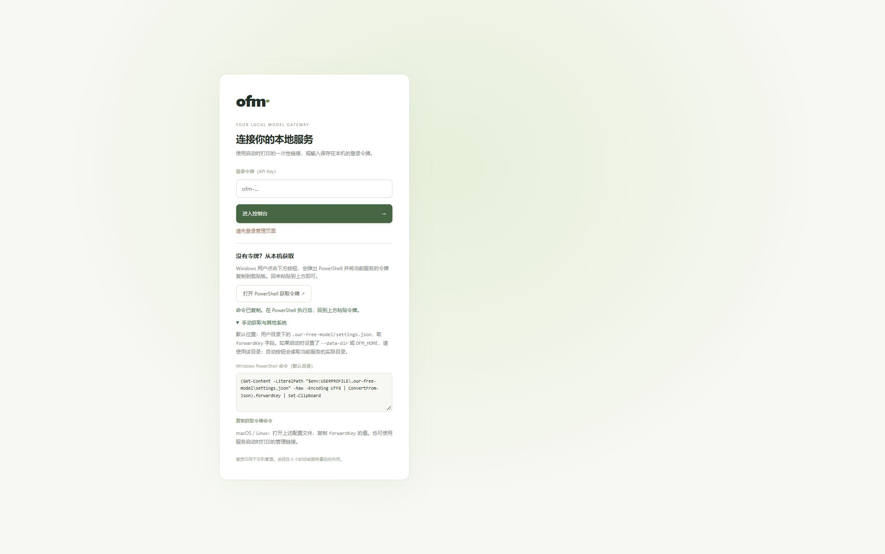

# 独立服务登录页本机取令牌入口验收

## 需求与实现

登录页增加「打开 PowerShell 获取令牌」按钮。Windows 本地服务启动可见窗口，
读取当前服务实际数据目录中的 `settings.json`，将 `forwardKey` 复制到剪贴板，
用户回到网页粘贴登录。支持自定义数据目录与包含空格、中文、单引号的路径。

页面同时提供配置文件位置、默认目录的 PowerShell 命令复制按钮，以及 macOS / Linux
的手动说明。自动启动仅支持 Windows；其他系统使用说明或启动时的一次性管理链接。

## 边界

- 登录前只允许本机页面带同源 Origin 和 `Sec-Fetch-Site: same-origin` 的 POST。
- 请求体必须是空 JSON 对象，不能指定命令、程序或文件路径。
- 原管理数据与推理接口仍要求凭据，不因打开窗口创建管理会话。
- 请求成功后只返回 `{ ok: true }`，不向未登录网页返回密钥。
- 并发打开及成功打开后 30 秒内重复点击均拒绝，启动失败可以重试。
- 隐藏的启动进程只负责打开用户可见的 PowerShell，令牌操作在该窗口内执行。

## 实际验证

- `node --check packages/standalone/login-terminal.mjs`：通过。
- `node --check packages/standalone/web/app.js`：通过。
- `npm run test:management`：14/14 通过。
  新增专项覆盖跨站/无来源调用、任意命令或路径参数、启动失败、并发打开、
  冷却期、同源 localhost 别名、返回值不含密钥以及打开窗口不授予管理会话。
- `npm run test:contributor`：32/32 套通过，包含渠道专项 11/11。
- `npm run test:release`：3/3 套通过。
- 浏览器在隔离目录的验收服务点击真实启动按钮，检测到可见窗口
  `Our Free Model - 获取登录令牌`，剪贴板与隔离验收令牌匹配。
  该目录包含中文、空格和单引号，实际读取成功。
- 点击备用复制命令按钮后，系统剪贴板与页面命令完全一致。
- `git diff --check`：通过。

隔离验收不使用用户账号或第三方授权。没有验收 macOS / Linux 实机，
这些系统的自动打开 PowerShell 不在本次支持范围内。

